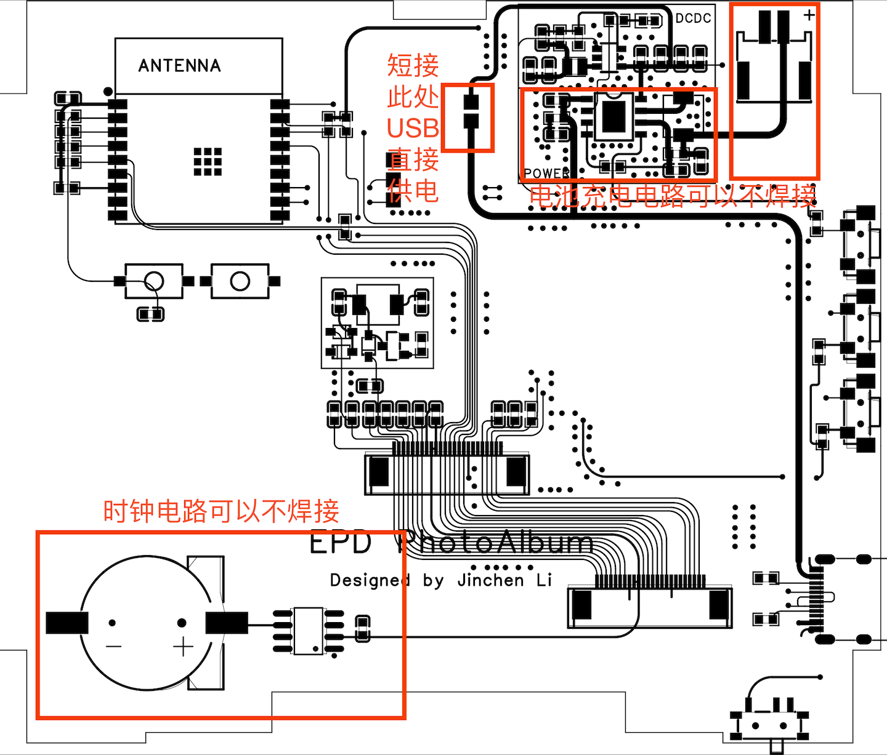

# 📷 ESP32-C3 三色墨水屏电子相册
[](https://www.gnu.org/licenses/agpl-3.0)

**许可证声明**  
本项目采用 **GNU Affero General Public License v3.0 (AGPLv3)**。  
- ✅ 允许：自由使用、修改、分发  
- 🔄 要求：衍生作品必须开源并保持相同许可证  
- 🌐 网络服务：若提供基于本项目的在线服务，必须公开修改后的源代码

**网络服务特别说明** 

若你将本项目用于提供在线服务（如 Web API、SaaS 平台），必须：
- 向所有用户公开修改后的源代码  
- 在服务显著位置提供源码获取方式（如页面底部链接）

---
本项目是一个 **无线电子相册系统**，由硬件端（ESP32-C3 + 三色墨水屏）和软件端（Java 上位机）组成，支持通过 Wi-Fi 上传图片并在墨水屏上显示黑、白、红三色图像。

## ✨ 功能特性
- **硬件端**  
  - 采用 ESP32-C3 微控制器，低功耗、支持 Wi-Fi。  
  - 驱动三色墨水屏（黑 / 白 / 红），适合低刷新率显示相片或文字。  

- **软件端（上位机）**  
  - 使用 Java Swing 开发，提供图形化界面。  
  - 支持选择图片、转换为三色墨水屏格式。  
  - 通过 Wi-Fi 将图片上传到 ESP32-C3。  

## 🔧 技术栈
- **硬件**：ESP32-C3、三色 E-Paper 墨水屏  
- **固件**：ESP32 Arduino 框架、GxEPD2
- **上位机**：Java（Swing GUI + Wi-Fi 通信）  

## 🚀 使用方式
1. 编译并烧录 ESP32-C3 固件。  
2. 上电，等待墨水屏显示WIFI、密码和IP地址，然后连接墨水屏显示的WIFI。
3. 在 Java 上位机中选择图片，处理图片，点击上传，IP地址保持默认。  
4. 图片经处理后通过 Wi-Fi 发送到 ESP32-C3，并显示在墨水屏上。


可以使用其他4.2寸墨水屏的项目中的外壳，与甘草群的4.2寸外壳兼容。
* https://oshwhub.com/hjh70526/4-2-cun-mo-shui-ping-yue-du-qi
* https://oshwhub.com/z294933698/4-2-cun-mo-shui-ping-gai_copy


### **PCB开源**

PCB开源地址：https://oshwhub.com/sadadaw/epd_photoalbum-kai-yuan-ban
  
上位机使用java开发


## 💻支持的墨水屏：
使用Arduino的GxEPD2库驱动，理论上GxEPD2能支持的墨水屏都可以支持。  

* GxEPD2：https://github.com/ZinggJM/GxEPD2

实测以下墨水屏可以使用： 

* WFT0420CZ15（使用GxEPD2_420c_Z21）  
* HINK-E042A13-A0（使用GxEPD2_420c_Z98，源码中的GxEPD2_420c_E042A13是我复制了一份改了个名字）
## ⚡️焊接说明：
当前版本的固件没有图片轮播和时钟功能，所以电池充电部分和时钟的元件可以不焊接，然后直接把VBUS和+5V的焊盘短接。




 
## 💻编译固件
需要修改ESP32C3默认SPI的管脚来匹配PCB的设计
### 方法一
> Arduino15/packages/esp32/hardware/esp32/<版本号>/variants/esp32c3/pins_arduino.h

例如我的文件在
> C:\Users\Administrator\AppData\Local\Arduino15\packages\esp32\hardware\esp32\2.0.11\variants\esp32c3\pins_arduino.h

将SPI管脚定义修改成下面这样
```C
static const uint8_t SS    = 7;
static const uint8_t MOSI  = 3;
static const uint8_t MISO  = 10;
static const uint8_t SCK   = 2;
```
**检查是否与IIC接口的管脚冲突**
### 方法二  

在代码中加入
```C
#include <SPI.h>

void setup() {
  // 自定义 SPI 引脚
  int SCK  = 2;   // 时钟
  int MISO = 10;   // 主输入
  int MOSI = 3;   // 主输出
  int CS   = 7;  // 片选

  SPI.begin(SCK, MISO, MOSI, CS);
  //将SPI传递给GxEPD
}

```
**使用此方法，我不了解如何将配置后的SPI传递给GxEPD的显示屏，需要自行研究**

## 💻编译上位机
### 一、先编译成 JAR

```bash
# 编译
javac EPDUploaderSwing.java -d out

# 打包 JAR（指定主类）
jar --create --file EPDUploaderSwing.jar --main-class EPDUploaderSwing -C out .
```

### 二、用 jpackage 生成应用

 依赖需求：JDK ≥ 14

#### Windows 生成exe：

```bash
jlink \
  --module-path $JAVA_HOME/jmods \
  --add-modules java.base,java.desktop \
  --output runtime

jpackage --name EPDUploaderSwing \
  --input . \
  --main-jar EPDUploaderSwing.jar \
  --main-class EPDUploaderSwing \
  --type app-image\
   --runtime-image runtime\
  --icon EPDUploaderSwing.icon
```

生成目录类似：

```
EPDUploaderSwing/
├── bin/EPDUploaderSwing.exe
├── lib/（依赖jar）
```

直接运行 `bin/EPDUploaderSwing.exe` 就行。

---

#### macOS 生成app：

```bash
jlink \
  --module-path $JAVA_HOME/jmods \
  --add-modules java.base,java.desktop \
  --output runtime

jpackage --name EPDUploaderSwing \
  --input . \
  --main-jar EPDUploaderSwing.jar \
  --main-class EPDUploaderSwing \
  --type app-image\
   --runtime-image runtime\
  --icon EPDUploaderSwing.icns

```

生成的目录类似：

```
EPDUploaderSwing.app/
└── Contents/
    ├── Info.plist
    ├── MacOS/EPDUploaderSwing
    └── Resources/app
```

双击 `EPDUploaderSwing.app` 就能运行。

